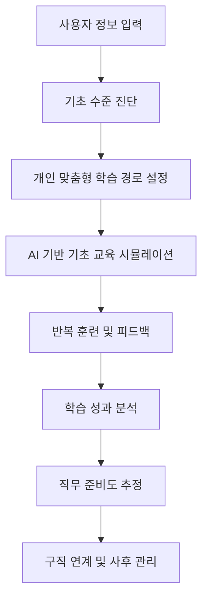
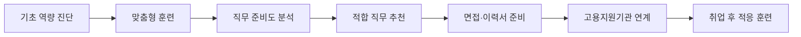

# 장애인 맞춤형 AI 기반 기초 교육 시뮬레이션 및 구직 연계 시스템 기획안

## 1. 기획 개요

본 기획안은 장애인 구직자가 자신의 장애 특성, 학습 수준, 성향, 희망 직무에 맞추어 직업 준비 역량을 훈련할 수 있도록 지원하는 **AI 기반 기초 교육 시뮬레이션 및 구직 연계 시스템**을 제안한다.

기존 온라인 직업 교육이 강의 시청 중심의 일방향 구조에 머물렀다면, 본 시스템은 AI 음성 대화, 캐릭터 기반 시뮬레이션, 반복 훈련, 단계별 피드백, 학습 성과 분석을 통해 실제 직장생활과 구직 과정에 가까운 훈련 환경을 제공하는 것을 목표로 한다.

---

## 2. 추진 배경

현재 많은 장애인들은 고품질의 직업 준비 교육과 현장형 훈련에 충분히 접근하지 못하고 있다. 특히 다음과 같은 이용자들은 직무교육 참여 자체가 쉽지 않다.

- 농어촌 지역 거주자
- 장거리 이동이 어려운 장애인
- 오프라인 훈련기관 접근성이 낮은 장애인
- 반복적이고 개별화된 훈련이 필요한 장애인

기존 온라인 교육은 물리적 접근성 문제를 일부 보완했지만, 대부분 강의 시청 중심으로 운영되어 학습자의 참여와 몰입을 충분히 이끌어내기 어렵다. 또한 실제 직장생활에서 필요한 의사소통, 안전 대응, 문서 이해, 업무 지시 파악, 문제 상황 보고 등의 역량을 충분히 훈련하기에는 한계가 있다.

따라서 장애인의 개인 특성과 실제 직업생활 상황을 반영한 **상호작용형 직업 준비 교육 시스템**이 필요하다.

---

## 3. 문제 정의

기존 온라인 직업 준비 교육은 다음과 같은 한계를 가진다.

### 3.1 일방향 강의 중심 구조

대부분의 온라인 교육은 강사가 설명하고 학습자가 시청하는 방식으로 구성되어 있다. 이로 인해 학습자가 직접 말하고, 선택하고, 상황에 대응하는 능력을 충분히 기르기 어렵다.

### 3.2 개인별 맞춤형 학습의 어려움

장애 유형, 이해 수준, 의사소통 방식, 디지털 활용 능력, 선호 직무가 서로 다름에도 불구하고 동일한 콘텐츠가 일괄 제공되는 경우가 많다.

### 3.3 실제 구직 및 직장생활과의 연결 부족

교육 내용이 실제 면접, 직무 수행, 직장 내 의사소통, 고용 유지 상황과 긴밀하게 연결되지 않으면 학습 결과가 취업 적응으로 이어지기 어렵다.

### 3.4 반복 훈련과 즉각 피드백의 부족

장애 특성에 따라 반복 학습과 명확한 피드백이 중요한 경우가 많지만, 기존 교육은 개인별 반복 훈련과 상호작용형 피드백 제공이 부족하다.

---

## 4. 해결 방향

본 사업은 단순히 온라인 강의를 제공하는 것이 아니라, 이용자의 현재 수준과 특성에 맞춘 **AI 기반 기초 교육 시뮬레이션**을 제공한다.

핵심 해결 방향은 다음과 같다.

1. **개인 맞춤형 진단**  
   장애 특성, 성향, 기초 역량, 희망 직무를 기반으로 학습 출발점을 설정한다.

2. **AI 상호작용형 훈련**  
   AI가 상사, 동료, 관리자, 담당자 등의 역할을 수행하고, 사용자는 음성 또는 대화형 인터페이스로 응답한다.

3. **반복 훈련 및 적응형 난이도 조절**  
   수행 결과에 따라 난이도를 조정하고 부족한 영역을 반복 학습한다.

4. **학습 성과 분석**  
   교육 이수도, 반복 훈련 결과, 상호작용 반응, 직무 준비도 등을 분석한다.

5. **구직 연계 지원**  
   학습 결과를 바탕으로 적합 직무를 추천하고, 취업 준비 및 고용 유지 단계로 연결한다.

---

## 5. 서비스 대상

본 시스템의 주요 대상은 다음과 같다.

- 직업 준비가 필요한 장애인 구직자
- 발달장애인, 지적장애인 등 반복적이고 상황 기반 훈련이 필요한 이용자
- 이동 제약으로 오프라인 직업훈련 참여가 어려운 이용자
- 농어촌 또는 교육 인프라 접근성이 낮은 지역의 이용자
- 장애인 직업훈련기관, 복지관, 고용지원기관, 특수교육기관

---

## 6. 전체 시스템 구조

---

## 7. 주요 프로세스

### 7.1 사용자 정보 입력

사용자는 초기 이용 단계에서 다음 정보를 입력한다.

- 인적사항
- 장애 특성
- 성향 및 특기
- 희망 직무 또는 관심 분야
- 선호 학습 방식
- 의사소통 방식
- 디지털 기기 활용 수준

이 정보는 이후 진단, 콘텐츠 추천, 난이도 조절, 구직 연계의 기초 데이터로 활용된다.

### 7.2 기초 수준 진단

사용자의 직업생활 기초 역량을 파악하기 위해 다음 항목을 진단한다.

- 이해도
- 의사소통 수준
- 디지털 활용 수준
- 문서 이해 수준
- 업무 지시 파악 능력
- 문제 상황 대응 능력
- 안전 인식 수준
- 직장 내 사회성 수준

### 7.3 맞춤형 기초 교육 시뮬레이션 제공

진단 결과에 따라 개인별 난이도와 학습 순서를 구성한다.

- 개인별 수준에 맞는 난이도 제공
- AI 음성 상호작용 기반 훈련
- 캐릭터 기반 상황 시뮬레이션
- 반복 학습 및 즉각 피드백
- 단계별 성취도 측정

### 7.4 학습 성과 분석

사용자의 학습 과정과 결과를 분석하여 직무 준비도를 추정한다.

- 교육 이수도
- 반복 훈련 결과
- 정답률 및 반응 시간
- 음성·대화 상호작용 반응
- 상황별 대응 능력
- 부족 영역 및 개선 추이
- 직무 준비도 점수

---

## 8. 핵심 기능

### 8.1 사용자 맞춤형 초기 진단 기능

장애 유형, 개인 특성, 선호, 희망 직무를 반영하여 이용자별 출발점을 설정한다. 이를 통해 동일한 콘텐츠를 일괄 제공하는 것이 아니라, 각 이용자에게 필요한 교육 수준과 방향을 다르게 설계할 수 있다.

#### 주요 기능

- 사용자 프로필 등록
- 장애 특성 및 지원 필요도 입력
- 희망 직무 선택
- 기초 역량 진단 문항 제공
- 초기 학습 경로 자동 추천

---

### 8.2 AI 기반 상호작용형 기초 교육 기능

기존 강의형 콘텐츠를 넘어, AI와 음성 또는 대화형 인터페이스로 상호작용하면서 학습하는 구조를 제공한다.

사용자는 실제 직장생활과 유사한 상황에서 질문에 답하거나 행동을 선택하며 학습한다. 시스템은 응답 결과를 분석하여 즉각적인 피드백을 제공한다.

#### 주요 기능

- AI 음성 대화 훈련
- 역할 기반 시뮬레이션
- 상사·동료·관리자 역할 대화
- 상황별 적절한 답변 연습
- 실시간 피드백 제공

---

### 8.3 반복 훈련 및 적응형 난이도 조절 기능

사용자의 수행 결과에 따라 난이도를 조정하고, 부족한 영역을 반복 훈련할 수 있도록 구성한다.

#### 주요 기능

- 정답률 기반 난이도 조절
- 반복 실패 영역 자동 추천
- 쉬운 표현, 보통 표현, 실제 직장 표현 단계화
- 음성 재시도 기능
- 단계별 성취 배지 제공

---

### 8.4 학습 성과 분석 기능

학습 결과를 데이터로 축적하여 개인별 성장 과정을 확인할 수 있도록 한다.

#### 주요 기능

- 교육 이수 현황 확인
- 훈련별 수행 결과 분석
- 직무 준비도 점수 산출
- 약점 영역 리포트 제공
- 기관 담당자용 관리 화면 제공

---

### 8.5 구직 연계 기능

학습 성과와 희망 직무 정보를 기반으로 이용자에게 적합한 직무 또는 구직 준비 방향을 제안한다.

#### 주요 기능

- 희망 직무별 필요 역량 매칭
- 학습 결과 기반 직무 추천
- 이력서·자기소개서 기초 작성 지원
- 면접 상황 시뮬레이션
- 직업훈련기관 및 고용지원기관 연계
- 취업 후 적응 훈련 콘텐츠 제공

---

## 9. 교육 모듈 구성

본 시스템은 기초 직업생활 역량을 중심으로 다음과 같은 교육 모듈을 제공한다.

| 모듈 | 목적 | 훈련 방식 |
|---|---|---|
| 사회성 훈련 모듈 | 직장 내 의사소통, 보고, 도움 요청, 거절, 피드백 수용 훈련 | AI 음성 대화형 훈련 |
| 안전 훈련 모듈 | 직장생활 및 일상 속 위험 상황 인식과 대응 훈련 | 캐릭터 기반 선택형 시뮬레이션 |
| 문서 이해 훈련 모듈 | 안내문, 업무 지시, 대화 내용 등 문자 정보 이해 훈련 | 문서·대화 기반 게임형 문제 풀이 |
| 구직 준비 모듈 | 면접, 이력서, 직무 선택, 출근 준비 등 취업 준비 훈련 | AI 코칭 및 시뮬레이션 |
| 직무 기초 모듈 | 사무, 서비스, 단순 노무 등 직무별 기본 수행 능력 훈련 | 직무 상황 기반 단계형 훈련 |

---

## 10. 세부 교육 모듈

## 10.1 사회성 훈련 모듈

### 목적

발달장애인이 직장 내에서 타인과 관계를 맺고, 필요한 말을 적절히 하며, 갈등이나 실수 상황에서도 안정적으로 대응할 수 있도록 지원한다.

### 구성 방식

- 캐릭터의 입이 움직이며 AI를 대신해 말하는 형식
- 실시간 음성 기반 AI 대화형 훈련
- AI가 상사, 동료, 담당자 등의 역할을 수행
- 사용자는 직접 말로 응답
- 응답 내용에 따라 AI가 피드백 제공

### 주요 훈련 영역

#### 1) 모호한 업무 지시 확인하기

직장에서 상사나 동료의 지시가 모호할 때 구체적으로 확인하는 연습을 한다.

예시 상황:

- “이거 넉넉히 복사해서 회의실에 갖다 둬요.”라고 지시받았지만 몇 장을 복사해야 하는지 모르는 상황
- 전화 상대가 연락처를 남기지 않고 끊으려는 상황
- “음료수 좀 종류별로 센스 있게 사 와요.”라는 모호한 지시를 받은 상황

평가 기준:

- 구체적인 수량을 확인했는가
- 상대방의 성함과 연락처를 정중히 요청했는가
- 필요한 물품의 종류와 개수를 구체적으로 되물었는가

#### 2) 업무 중 실수 보고하기

실수 상황에서 숨기지 않고 사실을 정확히 보고하며 대안을 제시하는 훈련을 한다.

예시 상황:

- 중요한 영수증 원본을 실수로 파쇄한 상황
- 회의실 예약을 깜빡한 상황
- 지하철 고장으로 출근이 늦어지는 상황

평가 기준:

- 즉시 사과했는가
- 실수 내용을 사실대로 말했는가
- 대안이나 예상 도착 시간을 제시했는가

#### 3) 부당하거나 어려운 부탁 거절하기

자신의 업무 범위가 아니거나 사생활을 침해하거나 안전을 해치는 요청에 대해 정중하지만 명확하게 거절하는 훈련을 한다.

예시 상황:

- 본인의 업무가 아닌 분리수거를 당연하다는 듯 지시받은 상황
- 장애, 수당, 사생활에 대한 불편한 질문을 받은 상황
- 기계를 멈추지 않고 위험한 방식으로 작업하라는 권유를 받은 상황

평가 기준:

- 현재 수행해야 할 업무가 있음을 설명했는가
- 개인적인 질문에 답하기 어렵다고 표현했는가
- 안전 원칙을 고수했는가

#### 4) 지적 및 피드백 수용하기

관리자의 지적을 들었을 때 감정적으로 대응하기보다 필요한 행동을 수행하는 훈련을 한다.

예시 상황:

- 청소 상태를 지적받은 상황
- 작업 속도가 느리다고 피드백을 받은 상황
- 안전모 착용을 지적받은 상황

평가 기준:

- 변명보다 수정 행동을 먼저 제시했는가
- 지적을 수용하고 개선 의지를 표현했는가
- 규칙 위반을 인정하고 즉시 행동을 수정했는가

#### 5) 도움 요청 및 조율하기

혼자 해결하기 어렵거나 위험한 상황에서 적절히 도움을 요청하는 훈련을 한다.

예시 상황:

- 기계에서 이상 소리가 나고 멈춘 상황
- 무거운 박스를 혼자 들기 어려운 상황
- 작업 순서가 기억나지 않는 상황

평가 기준:

- 문제 상황을 구체적으로 설명했는가
- 필요한 도움을 명확히 요청했는가
- 다시 알려달라고 솔직하게 요청했는가

#### 6) 휴식 및 신체 상태 보고하기

몸 상태가 좋지 않거나 부상을 입었을 때 즉시 보고하고 필요한 조치를 요청하는 훈련을 한다.

예시 상황:

- 갑자기 배가 아파 화장실에 가야 하는 상황
- 더운 날씨에 어지럽고 쓰러질 것 같은 상황
- 커터칼에 손을 베어 치료가 필요한 상황

평가 기준:

- 신체 상태를 명확히 설명했는가
- 자리를 비워도 되는지 허락을 구했는가
- 휴식 또는 치료가 필요함을 요청했는가

---

## 10.2 안전 훈련 모듈

### 목적

발달장애인이 직장생활과 일상 속에서 마주할 수 있는 위험 상황을 인식하고, 적절하게 대응할 수 있도록 지원한다.

### 구성 방식

- 캐릭터 기반 선택형 시뮬레이션 훈련
- 화면 속 캐릭터가 상황을 설명하거나 말을 거는 방식
- 사용자가 여러 선택지 중 적절한 답변 또는 행동 선택
- 선택 결과에 따라 O/X 피드백과 상황 연출 제공

### 주요 훈련 영역

#### 1) 성 관련 교육: 나의 경계 지키기

직장 내 신체 접촉, 사생활 질문, 사진 요구, 2차 피해 상황에 대응하는 훈련이다.

훈련 내용:

- 불쾌한 신체 접촉에 단호히 거절하기
- 사생활 질문에 답하지 않을 권리 인식하기
- 사진 요구를 거절하고 개인정보 보호하기
- 신고 이후 주변의 의심이나 압박에 대응하기

핵심 메시지:

- 나의 몸과 개인정보는 내가 지킬 수 있다.
- 불쾌한 접촉이나 질문에는 분명히 거절해도 된다.
- 주변의 의심이나 신고 취소 압박은 2차 피해가 될 수 있다.

#### 2) 감염병 대응: 함께 만드는 안심 일터

직장 내 감염병 예방과 몸 상태 보고를 훈련한다.

훈련 내용:

- 비누로 30초 이상 손 씻기
- 기침할 때 옷소매로 입과 코 가리기
- 열이 나고 몸이 아플 때 관리자에게 보고하고 쉬기

핵심 메시지:

- 감염병 예방은 나와 동료를 함께 지키는 행동이다.
- 아픈 것을 참고 일하는 것은 자신과 주변 사람 모두에게 위험할 수 있다.

#### 3) 출퇴근길 안전: 무사히 회사까지

출퇴근 과정에서 발생할 수 있는 교통안전 상황을 훈련한다.

훈련 내용:

- 걸으면서 스마트폰을 보지 않기
- 깜빡이는 신호에서 무리하게 뛰지 않기
- 버스 정류장에서 안전선 안쪽에서 기다리기
- 버스 안에서 손잡이를 꼭 잡기

핵심 메시지:

- 늦더라도 안전이 먼저다.
- 스마트폰보다 주변 확인과 손잡이 잡기가 우선이다.

---

## 10.3 문서 이해 훈련 모듈

### 목적

발달장애인이 직장생활에서 접하는 기본적인 문자 정보, 안내문, 대화 내용, 업무 지시를 이해할 수 있도록 지원한다.

### 구성 방식

- 문서·대화 기반 게임형 문제 풀이
- 짧은 안내문이나 대화 내용을 읽은 뒤 핵심 내용을 선택
- 업무 지시의 요지, 해야 할 행동, 주의사항을 고르는 방식

### 주요 훈련 내용

- 업무 지시문 이해하기
- 공지사항 핵심 내용 파악하기
- 안내문에서 날짜, 시간, 장소 찾기
- 금지사항과 주의사항 구분하기
- 대화 내용에서 상대방의 요청 파악하기
- 문서에서 해야 할 일 순서 찾기

### 예시 문제 유형

| 유형 | 예시 |
|---|---|
| 핵심 내용 고르기 | 안내문을 읽고 가장 중요한 내용을 선택 |
| 해야 할 일 찾기 | 업무 지시를 읽고 내가 해야 할 행동 선택 |
| 날짜·시간 찾기 | 공지문에서 회의 시간 또는 제출 기한 찾기 |
| 위험 문구 확인 | 안전 안내문에서 금지 행동 찾기 |
| 순서 배열 | 작업 절차를 올바른 순서로 배열 |

---

## 11. AI 활용 방식

### 11.1 AI 음성 상호작용

사용자는 텍스트 입력뿐 아니라 음성으로 AI와 대화할 수 있다. 이는 읽기나 타이핑이 어려운 이용자에게 접근성을 높여준다.

활용 예시:

- 상사 역할 AI와 업무 지시 확인 대화
- 동료 역할 AI와 거절 표현 연습
- 면접관 역할 AI와 면접 답변 연습
- 관리자 역할 AI에게 지각이나 부상 상황 보고 연습

### 11.2 AI 피드백 생성

AI는 사용자의 응답을 분석해 다음과 같은 피드백을 제공한다.

- 좋은 점
- 부족한 점
- 더 적절한 표현
- 다시 말해볼 문장 예시
- 상황별 주의사항

### 11.3 개인별 학습 경로 추천

AI는 진단 결과와 훈련 데이터를 기반으로 다음 학습 콘텐츠를 추천한다.

- 부족한 영역 재훈련
- 쉬운 단계 복습
- 높은 난이도 도전
- 희망 직무 관련 상황 훈련
- 구직 준비 콘텐츠 연계

---

## 12. 학습 데이터 및 성과 지표

### 12.1 수집 가능한 학습 데이터

- 훈련 참여 횟수
- 콘텐츠 이수율
- 정답률
- 재시도 횟수
- 응답 시간
- 음성 응답 정확도
- 상황별 피드백 이력
- 난이도 변화 이력

### 12.2 주요 성과 지표

| 구분 | 지표 |
|---|---|
| 학습 지속성 | 주간 접속률, 모듈 완료율, 반복 학습 횟수 |
| 역량 향상 | 진단 점수 변화, 정답률 변화, 피드백 개선도 |
| 직무 준비도 | 직무별 필수 역량 달성률, 상황 대응 점수 |
| 구직 연계 | 직무 추천 수, 면접 준비 완료율, 기관 연계 건수 |
| 고용 유지 | 취업 후 적응 훈련 참여율, 직장생활 문제 대응 개선도 |

---

## 13. 구직 연계 구조

본 시스템은 교육에서 끝나는 것이 아니라, 학습 결과를 바탕으로 구직 준비와 고용 유지까지 연결되는 구조를 지향한다.

### 구직 연계 세부 기능

- 직무별 필요 역량과 사용자 역량 비교
- 적합 직무 후보 추천
- 부족 역량 보완 훈련 제공
- 면접 상황 시뮬레이션
- 이력서 작성 보조
- 직업훈련기관 또는 고용지원기관 전달용 리포트 생성
- 취업 후 직장 적응 콘텐츠 제공

---

## 14. 기대효과

### 14.1 장애인 구직자의 직업 준비 역량 향상

개인의 수준과 특성에 맞는 상호작용형 훈련을 통해 직무 및 직장생활에 대한 이해도, 실무 자신감, 적응력을 향상시킬 수 있다.

### 14.2 교육 접근성 개선

이동이 어렵거나 오프라인 교육기관 이용이 어려운 장애인도 온라인 환경에서 실제 상황과 유사한 직업훈련을 받을 수 있다.

### 14.3 반복 학습을 통한 실질적 행동 변화

AI 기반 반복 훈련과 즉각 피드백을 통해 단순 지식 전달을 넘어 실제 행동 대응 능력을 높일 수 있다.

### 14.4 직업훈련기관의 교육 관리 효율 향상

기관 담당자는 학습자의 이수도, 성취도, 부족 영역을 데이터로 확인할 수 있어 개별 지원 계획을 수립하기 쉬워진다.

### 14.5 구직 및 고용 유지 가능성 제고

교육 성과를 구직 준비, 직무 매칭, 취업 후 적응 훈련과 연결함으로써 단기 취업뿐 아니라 장기적인 고용 유지까지 지원할 수 있다.

---

## 15. 향후 확장 방향

### 15.1 직무별 시뮬레이션 확대

초기에는 사회성, 안전, 문서 이해 중심으로 시작하고, 이후 다음 직무 영역으로 확장할 수 있다.

- 사무 보조
- 매장 관리
- 물류 보조
- 환경미화
- 주방 보조
- 제조·조립 보조
- 고객 응대 보조

### 15.2 기관용 관리자 대시보드 구축

기관 담당자가 이용자의 학습 현황을 관리할 수 있도록 대시보드를 제공한다.

- 학습자별 진도 확인
- 모듈별 성취도 확인
- 부족 영역 확인
- 상담 기록 관리
- 구직 연계 리포트 출력

### 15.3 보호자 및 지원인 연계 기능

필요한 경우 보호자, 직무지도원, 사회복지사, 취업지원 담당자와 학습 결과를 공유하여 통합 지원이 가능하도록 한다.

### 15.4 접근성 강화

장애 특성을 고려하여 다양한 접근성 기능을 제공한다.

- 큰 글씨 모드
- 쉬운 문장 모드
- 음성 안내
- 자막 제공
- 반복 듣기
- 그림 기반 설명
- 느린 속도 재생
- 쉬운 선택지 제공

---

## 16. 결론

본 시스템은 장애인 구직자에게 단순 교육 콘텐츠를 제공하는 것이 아니라, 개인의 수준과 특성에 맞는 **상호작용형 직업 준비 훈련 환경**을 제공한다.

AI 음성 대화, 캐릭터 기반 선택형 시뮬레이션, 반복 훈련, 성과 분석, 구직 연계를 통합함으로써 장애인의 직업 준비 역량을 실질적으로 높이고, 취업 적응과 고용 유지까지 지원하는 것을 목표로 한다.

이를 통해 장애인 구직자는 실제 직장생활에서 필요한 의사소통, 안전 대응, 문서 이해, 문제 상황 보고, 구직 준비 능력을 단계적으로 학습할 수 있으며, 기관은 데이터 기반으로 보다 체계적인 직업교육과 취업 지원을 제공할 수 있다.
